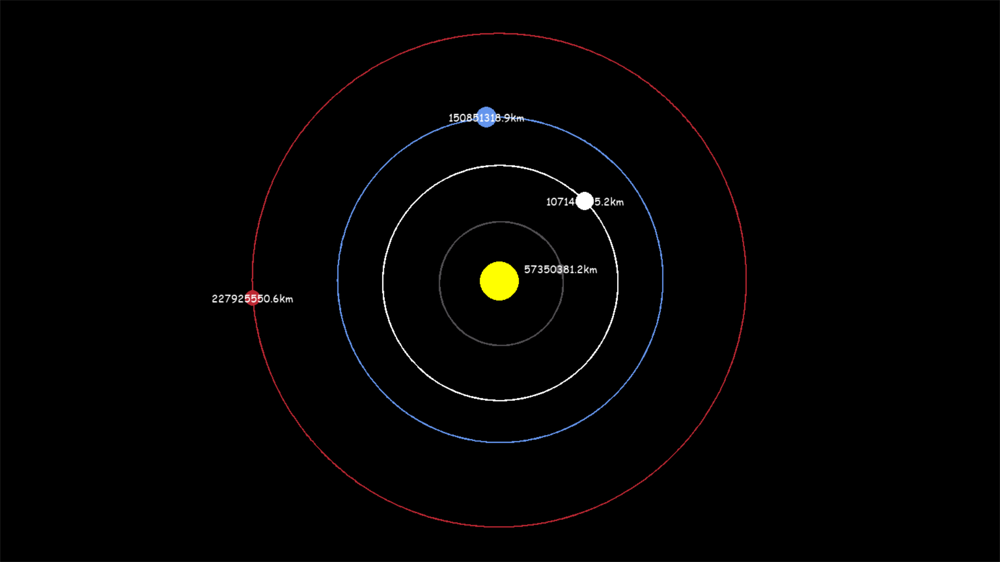

# Solar System Viewer
======================

A Python-based simulation of the solar system using Pygame.

## Description
---------------

This project simulates the movement of planets in our solar system using Pygame. The simulation includes the Sun and several planets, with their relative positions and velocities accurately represented.

## Features
------------

* Realistic planet movements and orbits
* Accurate scaling of planet sizes and distances
* Customizable simulation parameters (e.g. time step, scale)

## Requirements
---------------

* Python 3.x
* Pygame library

## Usage
-----

1. Clone the repository: `git clone https://github.com/Namit2111/Solar-System-Viewer`
2. Install the required libraries: `pip install pygame`
3. Run the simulation: `python Planet Simulator.py`

## Screenshot
-------------

